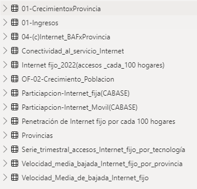

# El Internet en Argentina
2do Proyecto Henry - Telecomunicaciones


**Contacto:** 
LinkedIn :  [Alejandro de Alba](https://www.linkedin.com/in/alejandro-de-alba/) <br>
Mail : [a.dealba@bellizzia.com](a.dealba@bellizzia.com)


## Analisis de las telecomunicaciónes enfocados en Acceso a Internet en Argentina

**Descripción del proyecto:** 

El planteamiento del objetivo es analizar y comprender el panorama de las telecomunicaciones e Internet en Argentina. Utilizando informacion proporcionada por El Ente Nacional de Telecomunicciones de Argentina (ENACOM) realizamos un Análisis Exploratorio de Datos (EDA) para obtener información relevante sobre la penetración de Internet, la disponibilidad de conexiones, la velocidad promedio de bajada y otros aspectos clave relacionados con el acceso y uso de Internet.

El enfoque incluye la identificación de KPIs significativos, como la penetración de Internet por provincia, la disponibilidad y distribución de tipos de conexiones, y la velocidad promedio de descarga. Con estos datos, proporcionamos una visión detallada del mercado de Internet en Argentina, lo que permite tomar decisiones informadas y estratégicas para inversores interesados en el negocio de las telecomunicaciones.

El análisis brinda información valiosa sobre la situación actual del mercado de Internet en Argentina, sus competidores y oportunidades de inversión. Con estas conclusiones, se pueden tomar decisiones fundamentadas para abordar el mercado de Internet y sugerir recomendaciones para el ingreso al mercado y el desarrollo de fortalezas en el sector.


**Instrucciones de instalación:** 

En esta investigación recurrimos a Pyhton y diferentes librerias, así como los datos utilizados descargados de la pagina oficial de ENACOM y esta en archivos con formato CSV en el subdirectorio DATA.

En el archivo "requirements.txt" se encuentran los nombres de todas las librerias necesarias, esta podrán ser instaladas con la instruccion 
```pyhton
              pip install -r requirements.txt
```

En el repositorio se incluye el archivo **[01-Indice.md](00-EDA-Indice.md)** donde se enumeran y describen cada uno de los archivos y que contiene: los nombres de los archivos con links y una breve descripción del contenido de cada uno de ellos.


## **Introducción**

En el contexto actual, las telecomunicaciones desempeñan un papel fundamental en la sociedad, facilitando la transmisión de información a larga distancia a través de diversos medios electrónicos, como la telefonía, la televisión, la radio y, de manera destacada, el internet. Esta revolución en la comunicación ha transformado la forma en que las personas se relacionan, trabajan y acceden a la información en tiempo real.

El acceso a internet, en particular, ha emergido como un componente esencial en la vida cotidiana, permitiendo una conectividad global sin precedentes. Desde su creación, el internet ha generado un impacto significativo en la vida de las personas, brindando nuevas oportunidades de aprendizaje, trabajo, entretenimiento y comunicación instantánea.

En el contexto de esta transformación digital, una empresa prestadora de servicios de telecomunicaciones en Argentina ha encargado un análisis completo que permita comprender el comportamiento de este sector a nivel nacional. El enfoque principal de esta empresa es proporcionar acceso a internet de alta calidad, pero también es crucial comprender el comportamiento de otros servicios de comunicación para orientar adecuadamente la prestación de servicios, identificar oportunidades de crecimiento y ofrecer soluciones personalizadas a sus clientes.

Argentina, en comparación con la media mundial, se encuentra a la vanguardia en el desarrollo de las telecomunicaciones, con un total de 62,12 millones de conexiones registradas para el año 2020. Este contexto demuestra la relevancia y el dinamismo de la industria de las telecomunicaciones en el país, lo que hace que un análisis detallado y estratégico sea crucial para la toma de decisiones efectivas en esta empresa.

En este proyecto, se llevará a cabo un análisis exploratorio de datos (EDA) exhaustivo, la creación de un dashboard interactivo, el cálculo de indicadores clave de rendimiento (KPIs) relevantes para la industria y la presentación de conclusiones significativas. El objetivo es proporcionar una visión clara del panorama actual de las telecomunicaciones en Argentina y sentar las bases para la toma de decisiones informadas que impulsen el crecimiento y la calidad de los servicios prestados por la empresa.

## Trabajando con los datos
En los archivos expuestos en cada una de las faces se explica y muestra detalladamente el procedimiento donde se van transformando y analaziando los datos para llegar a las conclusiones expuestas.

### Indice de archivos
Archivo : [01-Indice.md](01-Indice.md)
En este archivo podemos encontrar la descripción de cada archivo que componen este proyecto

De acuerdo a los datos proporcionados por Henry, tenemos:

### Exploracion de datos (EDA)
Archivo : [02-ExploracionDatos.ipynb](02-ExploracionDatos.ipynb)

1. Adquisición de Datos:
	* Se recolectaron las 16 bases de datos de [ENACOM](https://datosabiertos.enacom.gob.ar/dashboards/20000/acceso-a-internet/) y se cargaron en df para analizar su contenido.
	* Tambien se recolectaron datos de [cable.co.uk](https://www.cable.co.uk/broadband/speed/worldwide-speed-league/) y de la [Camara Argentina de Internet](https://www.cabase.org.ar/en/home/)
2. Exploración Inicial:
	* Se Visualizaron las columnas y las primeras filas de cada conjunto de datos.
	* Identificar el tipo de datos de cada columna.
3. Limpieza de Datos:
	* Tratar valores nulos o faltantes.
	* Eliminar duplicados si es necesario.

### Analisis de los datos
Archivo : [03-Analisis_Datosipynb](03-Analisis_Datos.ipynb)

### KPI´s e Insights
Archivo : [04-KPI´s_e_Insights.ipynb](04-KPI´s_e_Insights.ipynb)
Se hace una lluvia de ideas para crear KPI's, de los cuales escogere los que seran expuestos en la presentación en Power Bi

### Graficando los KPI´s 
Archivo : [05-Graficando_KPI's.ipynb](05-Graficando_KPI's.ipynb)
Para poder entenderlos mejor se grafican y así poder escoger los mas interesantes para la presentación final

### Transformando los datos para graficarlos en Power BI
Archivo : [06-Transformacion_BD.ipynb](06-Transformacion_BD.ipynb)
Se hacen las adecuaciones necesarias para poder hacer la presentación en power bi

Al final se hicieron transformaciones quedandome con los siguientes archivos para incluirlos en Power BI

1. 01-CrecimientoxProvincia.csv
2. 01-Ingresos.csv
3. 04-(c)Internet_BAFxProvincia.csv
4. Conectividad_al_servicio_internet.csv
5. Internet fijo_2022(accesos_cada_100 hogares).csv
6. OF-02-Crecimiento_Poblacion.csv
7. Participacion_Internet_fija(CABASE).csv
8. Participacion_Internet_Movil(CABASE).csv
9. Penetrascion de Internet fijo por cada 100 hogares.csv
10. Provincias
11. Serie_trimestral_accesos_internet_fijo_por_tecnologia.csv
12. Velocidad_media_bajada_internet_fijo_por_provincia.csv
13. Velocidad_Media_de_bajada_internet_fijo.csv



### Conclusiones
En cuanto al mercado podemos observar un marcado oligopolio de las compañías que ofrecen el servicio de internet tanto en el mercado móvil como en la telefonía fija e internet directo. También se destaca el rápido crecimiento en ingresos.
Hablando del acceso a internet se destaca que existe una desigualdad muy marcada entre las provincias
Con respecto a las conexiones encontramos provincias con un muy rápido crecimiento y otras con crecimientos discretos
Con respecto a las Tecnologías usadas podemos destacar una supremacía en cablemódem y un rápido crecimiento de la fibra óptica
De la calidad del internet ofrecido también se detecta una disparidad muy marcada entre provincias,
De estas conclusiones podríamos sugerirlo siguiente:
* A pesar de que el mercado es un oligopolio, por su rápido crecimiento se considera factible hacer inversiones en servicios de internet, teniendo en cuenta que las inversiones podrían enfocarse a las provincias menos desarrolladas  y con mayor crecimiento en acceso a internet. 
* Otro de los puntos de tener en cuenta es que a pesar de ser el cable modem la tecnología más usada, se deberá de tener en cuenta el rápido crecimiento de la fibra óptica,  que es una tecnología mucho más reciente y capaz de ofrecer muchoa mejor velocidad al usuario mejorando por mucho la calidad promedio ofrecida en el país, además de que el gobierno ha puesto en sus prioridades y como una política publica el rápido crecimiento de las mismas.

* Como punto final. Creemos que se debería de hacer un estudio mas profundo de las preferencias de los usuarios, de las estrategias de mercado de los competidores, para poder salir al mercado con paquetes y servicios que se distingan en cuanto a gusto del cliente, calidad y precio 


## Consideraciones para la presentación

La presentacion del trabajo se decidio hacerla en Power Point incrustando diapositivas de Power Bi sin que las graficas perdieran su dinamismo.

Se seleccionaron solo algunos KPI's tratando de abarcar todas las areas:  Ingresos monetarios, Velocidad de internet, crecimiento  y  tenconologias. Esto fue por el tiempo de exposicion limitado, sin dejar de mensionar que existen varios kpi´s que son tambien muy interesantes para poder entender y conocer el mercado argentino de las telecomunicaciones, en concreto servicio de internet.
 